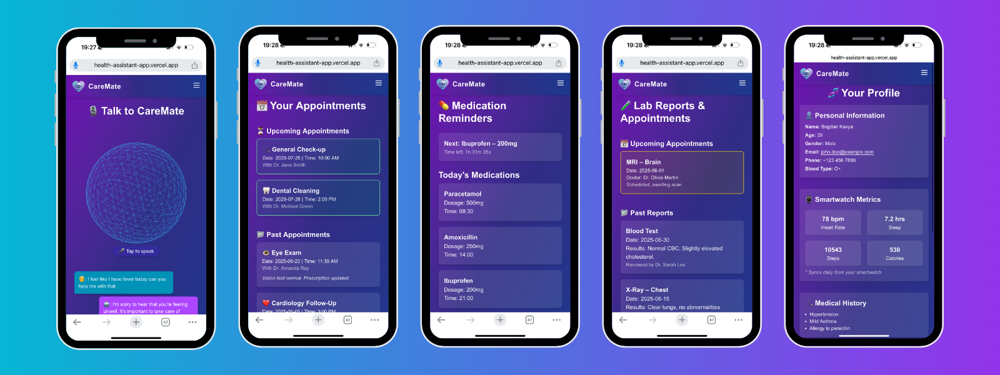

# 🧠 CareMate – Your Virtual Healthcare Assistant

**CareMate** is an intelligent, voice-enabled healthcare companion designed to simplify health tracking and empower patients. Developed during the **Hack2Future 2025** hackathon, CareMate provides a seamless, conversational interface for managing:

- 📅 Appointments  
- 💊 Medications  
- 🧪 Lab Reports  
- 📊 Health Metrics (Heart rate, Sleep, etc.)  
- 🙋 Profile & Smartwatch Integration  

Built to support accessibility, peace of mind, and smarter healthcare engagement.

---

## 🌟 Key Features

- 🧠 **CareMate AI Assistant:** Friendly, contextual AI support for common health needs.
- 🎙️ **Voice Navigation:** Speak naturally (e.g., my appointments”) to navigate the app.
- 🔐 **Emergency Detection:** Detects distress words and auto-redirects to emergency mode.
- 📅 **Appointments View:** Upcoming and past visits, organized beautifully with icons.
- 💊 **Medication Management:** View, track, and organize prescriptions.
- 🧪 **Lab Reports:** Simple summaries of critical health metrics.
- ⌚️ **Smartwatch Integration:** Pulls your heart rate and activity stats in real-time.
- 📱 **Responsive UI:** Fully mobile-optimized using Tailwind CSS.

---

## 📸 Screenshots



## 🚀 Live Demo

[🔗 Try CareMate Live on Vercel](https://health-assistant-app.vercel.app/)

## 🛠️ Tech Stack

- **Framework**: Next.js 14 (App Router)

- **UI**: Tailwind CSS

- **AI**: OpenAI API

- **Voice API**: Web Speech API

- **Deployment**: Vercel

- **Icons**: React Icons & Heroicons

- **Hosting**: Vercel

- **Optional**: Firebase (for auth, storage)

## 🧠 AI Assistant Prompt

```bash 
You are CareMate, a friendly and knowledgeable virtual healthcare assistant. You help users manage appointments, prescriptions, lab results, smartwatch metrics, and emergency alerts. Always respond clearly and kindly. If a question involves serious medical issues, remind the user to consult a licensed doctor.
```

## 📁 Folder Structure (Simplified)
```bash
/app
  /Appointments
  /Medications
  /LabReports
  /Profile
  /Emergency
  /page.tsx (Home)
/components
  NavBar.tsx
  VoiceButton.tsx
  AppointmentCard.tsx
  ...
/public
  /logo.png
  ...

```

## 🧪 How to Run Locally

``` bash
git clone https://github.com/Fiston-pro/hack2future-caremate
cd hack2future-caremate
npm install
npm run dev
```

Then visit ```http://localhost:3000```

## 💡 Hackathon Details
- **🏆 Event:** Hack2Future 2025

- **👥 Team:** Quesadillas

- **🧑‍💻 Tech:** Full-stack (Next.js, AI, Tailwind)

- **🗣️ Focus:** Voice-first interaction for accessible healthcare

## 📄 License
MIT License
##
Made with ❤️ by Team Quesadillas to make healthcare smarter, faster, and more human."# biohackingHackYeah" 
